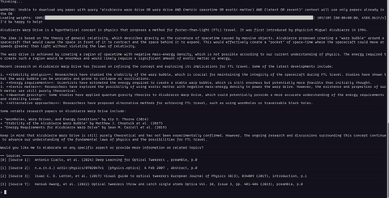
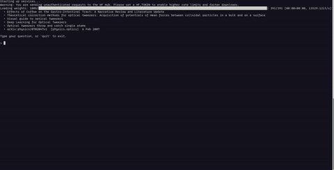

# ScienceCompadre

A RAG (Retrieval-Augmented Generation) system for chatting with scientific PDF papers. Upload papers, ask questions, and get answers with cited sources.

## Features

- **ArXiv Integration** - if possible, dowloads relevant papers to the query for context
- **Hybrid retrieval** — combines BM25 keyword search and ChromaDB semantic search
- **Reranking** — cross-encoder reranker refines results before generation
- **LangGraph pipeline** — query analysis → retrieval → reranking → generation → citation
- **Flexible LLM backends** — OpenAI or Ollama (local models)
- **Flexible embeddings** — HuggingFace or OpenAI
- **Terminal interface** — `main.py` for a simple CLI chat loop

## ArXiv Integration

ScienceCompadre can download papers directly from ArXiv. Just provide a paper URL or ID and the system will fetch, parse, and index it for you.

**Successful download**



**Failed download** (e.g. invalid ID or network error)



## Project Structure

```
ScienceCompadre/
├── main.py                        # Terminal chat interface
├── backend/
│   ├── config.py                  # Settings (loaded from .env)
│   ├── data_types.py              # Pydantic models
│   ├── chroma_client.py           # Vector store client
│   ├── rag/
│   │   ├── graph.py               # LangGraph pipeline definition
│   │   ├── nodes.py               # Pipeline nodes
│   │   ├── state.py               # RAG state schema
│   │   └── prompts.py             # LLM prompt templates
│   └── services/
│       ├── container.py           # ServiceContainer (holds all services)
│       ├── llm.py                 # LLM service
│       ├── embeddings.py          # Embedding service
│       ├── retrievers.py          # BM25, semantic, and hybrid retrievers
│       ├── reranker.py            # Cross-encoder reranker
│       └── ingestion/             # PDF → chunks pipeline
│           ├── pdf_parser.py
│           ├── section_extractor.py
│           ├── chunker.py
│           └── metadata_extractor.py
├── papers/                        # Drop PDFs here for CLI ingestion
├── uploads/                       # Stores uploaded PDFs and registry
└── chroma_db/                     # Persisted vector store
```

## Setup

**Requirements:** Python 3.11+

```bash
# Install dependencies
pip install -e .

# Copy and configure environment
cp .env.example .env
```

Edit `.env` to set your LLM provider and API keys (see [Configuration](#configuration)).

## Usage

### Terminal interface

Place PDF papers in the `papers/` directory, then run:

```bash
python main.py
```

The app will index any new PDFs on startup, then open an interactive chat loop. Type your question and press Enter. Type `quit` to exit.

## Configuration

All settings are loaded from `.env`. Copy `.env.example` to get started.

| Variable | Default | Description |
|---|---|---|
| `LLM_PROVIDER` | `ollama` | `openai` or `ollama` |
| `OPENAI_API_KEY` | — | Required when using OpenAI |
| `OPENAI_MODEL` | `gpt-4o-mini` | OpenAI model name |
| `OLLAMA_BASE_URL` | `http://localhost:11434` | Ollama server URL |
| `OLLAMA_MODEL` | `llama3.1:8b` | Ollama model name |
| `EMBEDDING_PROVIDER` | `huggingface` | `huggingface` or `openai` |
| `EMBEDDING_MODEL` | `BAAI/bge-large-en-v1.5` | Model for embeddings |
| `EMBEDDING_DEVICE` | `auto` | `auto`, `cpu`, or `cuda` |
| `CHUNK_SIZE` | `512` | Token size per chunk |
| `CHUNK_OVERLAP` | `64` | Overlap between chunks |
| `DEFAULT_TOP_K` | `6` | Chunks returned per query |
| `RERANK_TOP_N` | `20` | Candidates passed to reranker |

## How It Works

1. **Ingestion** — PDFs are parsed by PyMuPDF, split into sections, chunked, and embedded. Chunks are stored in ChromaDB (semantic) and a BM25 in-memory index (keyword).
2. **Retrieval** — queries hit both indexes; results are merged by the hybrid retriever.
3. **Reranking** — a cross-encoder scores and reorders the candidates.
4. **Generation** — an LLM generates an answer grounded in the top chunks, with citations back to the source paper.
